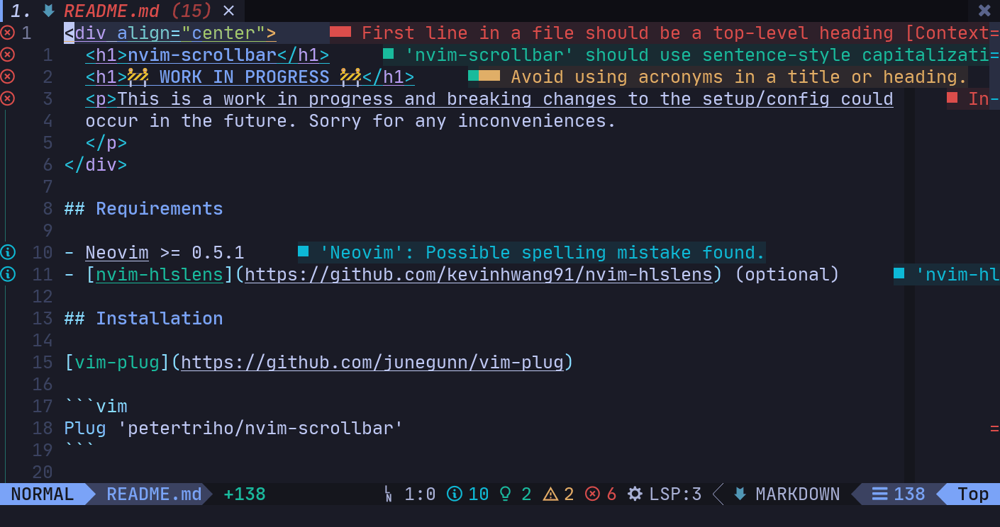
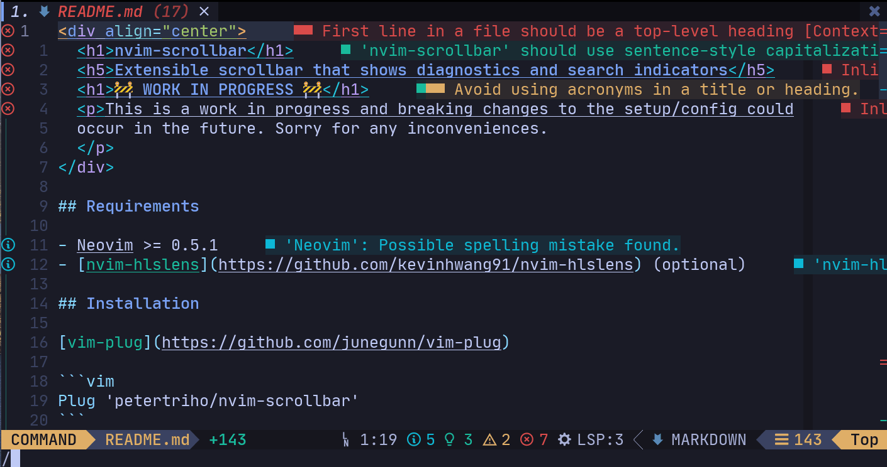

<div align="center">
  <h1>nvim-scrollbar</h1>
  <h5>Extensible Neovim Scrollbar</h5>
</div>



## Features

- ALE
- Cursor
- Diagnostics (COC and Native)
- Git (requires [gitsigns.nvim](https://github.com/lewis6991/gitsigns.nvim))
- Search (requires [nvim-hlslens](https://github.com/kevinhwang91/nvim-hlslens))

## Requirements

- Neovim >= 0.5.1
- [nvim-hlslens](https://github.com/kevinhwang91/nvim-hlslens) (optional)
- [gitsigns.nvim](https://github.com/lewis6991/gitsigns.nvim) (optional)

## Installation

[vim-plug](https://github.com/junegunn/vim-plug)

```vim
Plug 'petertriho/nvim-scrollbar'
```

[packer.nvim](https://github.com/wbthomason/packer.nvim)

```lua
use("petertriho/nvim-scrollbar")
```

## Setup

```lua
require("scrollbar").setup()

```

<details>
  <summary>Search</summary>



#### Setup (Packer)

```lua
use {
  "kevinhwang91/nvim-hlslens",
  config = function()
    -- require('hlslens').setup() is not required
    require("scrollbar.handlers.search").setup({
        -- hlslens config overrides
    })
  end,
}
```

OR

```lua
use {
  "kevinhwang91/nvim-hlslens",
  config = function()
    require("hlslens").setup({
       build_position_cb = function(plist, _, _, _)
            require("scrollbar.handlers.search").handler.show(plist.start_pos)
       end,
    })

    vim.cmd([[
        augroup scrollbar_search_hide
            autocmd!
            autocmd CmdlineLeave : lua require('scrollbar.handlers.search').handler.hide()
        augroup END
    ]])
  end,
}
```

If you want to leave only search marks and disable virtual text:

```lua
require("scrollbar.handlers.search").setup({
    override_lens = function() end,
})
```

</details>

<details>
  <summary>Git Signs</summary>

https://user-images.githubusercontent.com/889383/201331485-477677a7-40a9-4731-998a-34779f7123ff.mp4

Display git changes in the sidebar. Requires [gitsigns.nvim](https://github.com/lewis6991/gitsigns.nvim) to be installed.

#### Setup (Packer)

```lua
use {
  "lewis6991/gitsigns.nvim",
  config = function()
    require('gitsigns').setup()
    require("scrollbar.handlers.gitsigns").setup()
  end
}
```
</details>

## Config

<details>
  <summary>Defaults</summary>

```lua
require("scrollbar").setup({
    show = true,
    show_in_active_only = false,
    set_highlights = true,
    folds = 1000, -- handle folds, set to number to disable folds if no. of lines in buffer exceeds this
    max_lines = false, -- disables if no. of lines in buffer exceeds this
    hide_if_all_visible = false, -- Hides everything if all lines are visible
    throttle_ms = 100,
    handle = {
        text = " ",
        blend = 30, -- Integer between 0 and 100. 0 for fully opaque and 100 to full transparent. Defaults to 30.
        color = nil,
        color_nr = nil, -- cterm
        highlight = "CursorColumn",
        hide_if_all_visible = true, -- Hides handle if all lines are visible
    },
    marks = {
        Cursor = {
            text = "•",
            priority = 0,
            gui = nil,
            color = nil,
            cterm = nil,
            color_nr = nil, -- cterm
            highlight = "Normal",
        },
        Search = {
            text = { "-", "=" },
            priority = 1,
            gui = nil,
            color = nil,
            cterm = nil,
            color_nr = nil, -- cterm
            highlight = "Search",
        },
        Error = {
            text = { "-", "=" },
            priority = 2,
            gui = nil,
            color = nil,
            cterm = nil,
            color_nr = nil, -- cterm
            highlight = "DiagnosticVirtualTextError",
        },
        Warn = {
            text = { "-", "=" },
            priority = 3,
            gui = nil,
            color = nil,
            cterm = nil,
            color_nr = nil, -- cterm
            highlight = "DiagnosticVirtualTextWarn",
        },
        Info = {
            text = { "-", "=" },
            priority = 4,
            gui = nil,
            color = nil,
            cterm = nil,
            color_nr = nil, -- cterm
            highlight = "DiagnosticVirtualTextInfo",
        },
        Hint = {
            text = { "-", "=" },
            priority = 5,
            gui = nil,
            color = nil,
            cterm = nil,
            color_nr = nil, -- cterm
            highlight = "DiagnosticVirtualTextHint",
        },
        Misc = {
            text = { "-", "=" },
            priority = 6,
            gui = nil,
            color = nil,
            cterm = nil,
            color_nr = nil, -- cterm
            highlight = "Normal",
        },
        GitAdd = {
            text = "┆",
            priority = 7,
            gui = nil,
            color = nil,
            cterm = nil,
            color_nr = nil, -- cterm
            highlight = "GitSignsAdd",
        },
        GitChange = {
            text = "┆",
            priority = 7,
            gui = nil,
            color = nil,
            cterm = nil,
            color_nr = nil, -- cterm
            highlight = "GitSignsChange",
        },
        GitDelete = {
            text = "▁",
            priority = 7,
            gui = nil,
            color = nil,
            cterm = nil,
            color_nr = nil, -- cterm
            highlight = "GitSignsDelete",
        },
    },
    excluded_buftypes = {
        "terminal",
    },
    excluded_filetypes = {
        "dropbar_menu",
        "dropbar_menu_fzf",
        "DressingInput",
        "cmp_docs",
        "cmp_menu",
        "noice",
        "prompt",
        "TelescopePrompt",
    },
    autocmd = {
        render = {
            "BufWinEnter",
            "TabEnter",
            "TermEnter",
            "WinEnter",
            "CmdwinLeave",
            "TextChanged",
            "VimResized",
            "WinScrolled",
        },
        clear = {
            "BufWinLeave",
            "TabLeave",
            "TermLeave",
            "WinLeave",
        },
    },
    handlers = {
        cursor = true,
        diagnostic = true,
        gitsigns = false, -- Requires gitsigns
        handle = true,
        search = false, -- Requires hlslens
        ale = false, -- Requires ALE
    },
})
```

</details>

## Colors/Highlights

Color takes precedence over highlight i.e. if color is defined, that will be
used to define the highlight instead of highlight.

Mark type highlights are in the format of `Scrollbar<MarkType>` and
`Scrollbar<MarkType>Handle`. If you wish to define these yourself, add
`set_highlights = false` to the setup.

- `ScrollbarHandle`
- `ScrollbarCursorHandle`
- `ScrollbarCursor`
- `ScrollbarSearchHandle`
- `ScrollbarSearch`
- `ScrollbarErrorHandle`
- `ScrollbarError`
- `ScrollbarWarnHandle`
- `ScrollbarWarn`
- `ScrollbarInfoHandle`
- `ScrollbarInfo`
- `ScrollbarHintHandle`
- `ScrollbarHint`
- `ScrollbarMiscHandle`
- `ScrollbarMisc`
- `ScrollbarGitAdd`
- `ScrollbarGitAddHandle`
- `ScrollbarGitChange`
- `ScrollbarGitChangeHandle`
- `ScrollbarGitDelete`
- `ScrollbarGitDeleteHandle`

### Example config with [tokyonight.nvim](https://github.com/folke/tokyonight.nvim) colors

```lua
local colors = require("tokyonight.colors").setup()

require("scrollbar").setup({
    handle = {
        color = colors.bg_highlight,
    },
    marks = {
        Search = { color = colors.orange },
        Error = { color = colors.error },
        Warn = { color = colors.warning },
        Info = { color = colors.info },
        Hint = { color = colors.hint },
        Misc = { color = colors.purple },
    }
})
```

## Custom Handlers

One can define custom handlers consisting of a name and a lua function that returns a list of marks as follows:

```lua
require("scrollbar.handlers").register(name, handler_function)
```

`handler_function` receives the buffer number as argument and must return a list of tables with `line`, `text`, `type`, and `level` keys. Only the `line` key is required.

| Key     | Description                                                   |
| ------- | ------------------------------------------------------------- |
| `line`  | The line number. _Required_.                                  |
| `text`  | Marker text. Defaults to global settings depending on `type`. |
| `type`  | The marker type. Default is `Misc`.                           |
| `level` | Marker level. Default is `1`.                                 |

E.g. the following marks the first three lines in every buffer.

```lua
require("scrollbar.handlers").register("my_marks", function(bufnr)
    return {
        { line = 0 },
        { line = 1, text = "x", type = "Warn" },
        { line = 2, type = "Error" }
    }
end)
```

## Acknowledgements

- [kevinhwang91/nvim-hlslens](https://github.com/kevinhwang91/nvim-hlslens) for implementation on how to hide search results

## License

[MIT](https://choosealicense.com/licenses/mit/)
