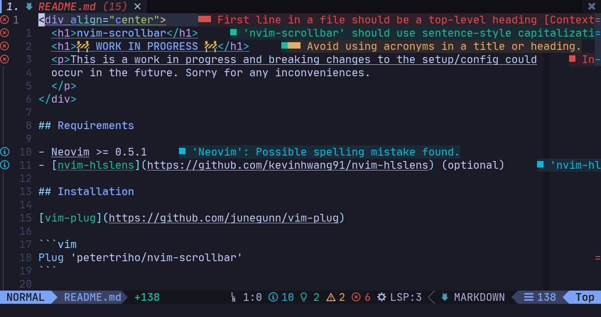

<div align="center">
  <h1>nvim-scrollbar</h1>
  <h5>Extensible floating scrollbars for Neovim</h5>
</div>



`nvim-scrollbar` renders one floating scrollbar per source window, with independent
handles for split windows, typed mark providers, optional screen-row-accurate
geometry, and mouse navigation.

## Requirements

- Neovim 0.11 or newer
- The user's Neovim `mouse` option must enable the desired modes for mouse
  interaction, for example `set mouse=a`. The plugin never changes `mouse`.
- Optional integrations:
  [gitsigns.nvim](https://github.com/lewis6991/gitsigns.nvim),
  [ALE](https://github.com/dense-analysis/ale), and
  [coc.nvim](https://github.com/neoclide/coc.nvim)

Versions of Neovim older than 0.11 are not supported.

## Installation

[lazy.nvim](https://github.com/folke/lazy.nvim):

```lua
{
    "petertriho/nvim-scrollbar",
    opts = {},
}
```

[vim-plug](https://github.com/junegunn/vim-plug):

```vim
Plug 'petertriho/nvim-scrollbar'
```

Then configure the plugin from Lua:

```lua
require("scrollbar").setup()
```

## Configuration

Unknown keys and invalid values are rejected. The complete defaults are:

```lua
require("scrollbar").setup({
    show = true,
    visibility = "all", -- "all" or "active"
    set_highlights = true,
    max_lines = false, -- false or a positive line limit
    hide_if_all_visible = false,
    render = {
        interval_ms = 16,
        geometry = "line", -- "line" or "screen"
    },
    float = {
        width = 1,
        zindex = 50,
        placement = {
            relative = "window", -- "window" or "editor"
            anchor = "NE", -- "NW", "NE", "SW", or "SE"
            row = 0,
            col = 0,
        },
    },
    mouse = {
        enabled = true,
    },
    handle = {
        text = " ",
        column = 1,
        width = 1,
        blend = 30,
        highlight = "CursorColumn",
        hide_if_all_visible = true,
    },
    marks = {
        Cursor = {
            text = { "•" },
            column = 1,
            priority = 0,
            highlight = "Normal",
        },
        Search = {
            text = { "-", "=" },
            column = 1,
            priority = 1,
            highlight = "Search",
        },
        Error = {
            text = { "-", "=" },
            column = 1,
            priority = 2,
            highlight = "DiagnosticVirtualTextError",
        },
        Warn = {
            text = { "-", "=" },
            column = 1,
            priority = 3,
            highlight = "DiagnosticVirtualTextWarn",
        },
        Info = {
            text = { "-", "=" },
            column = 1,
            priority = 4,
            highlight = "DiagnosticVirtualTextInfo",
        },
        Hint = {
            text = { "-", "=" },
            column = 1,
            priority = 5,
            highlight = "DiagnosticVirtualTextHint",
        },
        Misc = {
            text = { "-", "=" },
            column = 1,
            priority = 6,
            highlight = "Normal",
        },
        GitAdd = {
            text = { "┆" },
            column = 1,
            priority = 7,
            highlight = "GitSignsAdd",
        },
        GitChange = {
            text = { "┆" },
            column = 1,
            priority = 7,
            highlight = "GitSignsChange",
        },
        GitDelete = {
            text = { "▁" },
            column = 1,
            priority = 7,
            highlight = "GitSignsDelete",
        },
    },
    providers = {
        cursor = true,
        diagnostic = true,
        search = true, -- true or { live = boolean }
        gitsigns = false,
        ale = false,
        coc = false,
    },
    excluded_buftypes = {
        "terminal",
    },
    excluded_filetypes = {
        "blink-cmp-menu",
        "dropbar_menu",
        "dropbar_menu_fzf",
        "DressingInput",
        "cmp_docs",
        "cmp_menu",
        "noice",
        "prompt",
        "TelescopePrompt",
    },
})
```

`handle.column`, `handle.width`, and mark columns are one-based display-cell
coordinates. The handle must fit within `float.width`. Mark text is clipped at
the right edge without splitting a multi-cell character.

Handle and mark `highlight` values accept either a highlight group name or a
full table accepted by `nvim_set_hl()`. String values retain colorscheme-linked
behavior; tables can define colors and attributes directly.

### Visibility

- `visibility = "all"` creates an independent scrollbar for every eligible
  normal window. Two windows showing the same buffer retain different handles.
- `visibility = "active"` keeps only the active source window's scrollbar.
- `show = false` starts hidden. `show()`, `hide()`, and `toggle()` operate on all
  plugin-owned scrollbars.
- `max_lines` excludes buffers above the configured logical line count.
- `hide_if_all_visible` hides the whole scrollbar when the document fits.
  `handle.hide_if_all_visible` hides only the handle.

### Placement

`float.placement.relative` selects the placement container:

- `"window"` attaches one float to each source window.
- `"editor"` uses editor coordinates and always renders only the active source
  window, regardless of `visibility`, so multiple floats do not overlap. Its
  horizontal anchors use the editor width, while its vertical anchors align with
  the active source window's text area.

`anchor` selects the float corner attached to the matching container corner.
`row` and `col` are signed offsets from that corner: positive rows move down and
positive columns move right. For example:

```lua
require("scrollbar").setup({
    float = {
        placement = {
            relative = "window",
            anchor = "NW",
            row = 1,
            col = 2,
        },
    },
})
```

The renderer owns the float height, scratch buffer, focusability, mouse flag,
style, and source-window association. `float.width`, `float.zindex`, and the
typed placement fields are the supported float controls.

Scrollbar tracks cover source buffer-text rows only. They exclude the source
window's winbar and remain within window bounds that already exclude tabline,
statusline, and command-line chrome. Explicit signed `row` offsets are still
applied literally and can intentionally move a track outside those bounds.

### Geometry

`render.geometry = "line"` is the default. It maps logical source lines to the
track, performs no fold scan, and keeps render work independent of total buffer
line count apart from the current marks.

`render.geometry = "screen"` uses `nvim_win_text_height()` so marks and the
handle share coordinates that account for wrapping, closed folds, diff filler,
virtual lines, `topfill`, and wrapped-line offsets. Screen geometry is recomputed
for each dirty render. It is more accurate and intentionally more expensive;
it is not expected to outperform line geometry.

When the document's logical or rendered height fits within the track, marks
align directly with their source or screen rows and unused rows below the
document remain blank. Taller documents are proportionally compressed across
the track.

`render.interval_ms` is the frame-coalescing interval. Repeated invalidations
within one frame render the latest state once. Scrolling invalidates geometry
without recollecting provider marks.

### Mouse

Mouse support installs `<LeftMouse>`, `<LeftDrag>`, and `<LeftRelease>` mappings
only in scrollbar float buffers. It does not install global mappings or modify
`vim.o.mouse`.

- Clicking a visible mark jumps to that mark's exact source line.
- Clicking empty track space jumps directly by row when the document fits and
  proportionally when it is taller than the track. Rows below short content
  clamp to the final source line.
- Pressing on the handle and moving drags it while preserving the grab offset.
- A mark over the handle is an exact mark click if released without movement;
  moving starts a handle drag.
- Navigation moves the source cursor, opens only the containing fold with `zv`,
  centers with `zz`, and restores source-window focus on completion or cancel.

Set `mouse.enabled = false` to make scrollbar floats non-focusable and omit the
mappings. Even when enabled, interaction works only in modes allowed by the
user's `mouse` option, such as `vim.o.mouse = "a"`.

## Providers

Built-in providers are configured under `providers`:

| Provider | Default | Source | Optional dependency |
| --- | --- | --- | --- |
| `cursor` | on | Current source cursor | None |
| `diagnostic` | on | Neovim 0.11 `vim.diagnostic` | None |
| `search` | on | Native `/` and `?` search | None |
| `gitsigns` | off | Git hunks | gitsigns.nvim |
| `ale` | off | ALE location list | ALE |
| `coc` | off | Coc diagnostic list | coc.nvim |

Optional providers safely produce no marks when their dependency is absent.

### Search

Accepted-search mode is enabled by default. `search = true` is equivalent to
`search = { live = false }`. It updates after `/` or `?` is accepted and follows
native search visibility. Marks clear after `:nohlsearch`, `set nohlsearch`, or
an empty search pattern. Set `providers.search = false` to disable it.

Live mode previews valid patterns while the search command line changes:

```lua
require("scrollbar").setup({
    providers = {
        search = { live = true },
    },
})
```

Live mode scans the current buffer for each command-line pattern change, so
accepted-search mode is preferable for large buffers.

### Custom Providers

Managed providers can be registered before or after `require("scrollbar").setup()`.
Names must be unique; registration never replaces another provider implicitly.
Unregistering disposes the provider, removes its augroups and cleanups, clears
its marks, and invalidates affected windows.

Marks use zero-based source lines:

```lua
---@class ScrollbarMark
---@field line integer -- zero-based source line
---@field type string -- a configured entry in `marks`
---@field text? string -- optional text override
```

A simple refresh-only provider is refreshed initially and on eligible buffer
entry and content changes:

```lua
local providers = require("scrollbar.providers")

providers.register({
    name = "bookmarks",
    refresh = function(bufnr, context)
        local last = vim.api.nvim_buf_line_count(bufnr) - 1
        return {
            { line = 0, type = "Bookmark" },
            { line = last, type = "Bookmark", text = "B" },
        }
    end,
})

require("scrollbar").setup({
    marks = {
        Bookmark = {
            text = { "·", "•", "#" },
            column = 1,
            priority = 1,
            highlight = "Special",
        },
    },
})

-- This also works after setup and triggers immediate setup/refresh.
-- providers.register(another_provider)

providers.unregister("bookmarks")
```

The optional provider methods are:

```lua
---@class ScrollbarProvider
---@field name string
---@field setup? fun(context: ScrollbarProviderContext)
---@field refresh? fun(bufnr: integer, context: ScrollbarProviderContext): ScrollbarMark[]?
---@field dispose? fun(context: ScrollbarProviderContext)
```

`context` exposes a read-only-by-convention configuration snapshot and these
managed operations:

| Context member | Purpose |
| --- | --- |
| `config` | Provider-local copy of the normalized configuration |
| `set_marks(bufnr, marks)` | Atomically validate and replace this provider's marks |
| `clear_marks(bufnr?)` | Clear one buffer or all marks owned by this provider |
| `create_augroup(name)` | Create a provider-owned augroup removed on dispose |
| `add_cleanup(fn)` | Register another provider-owned cleanup callback |
| `source_windows(bufnr?)` | Enumerate eligible source windows |
| `invalidate_buffer(bufnr)` | Queue windows displaying a buffer |
| `invalidate_window(winid)` | Queue one source window |

Providers with custom subscriptions should create them in `setup()` through
`context.create_augroup()`, publish through `set_marks()`, and release non-autocmd
resources through `add_cleanup()` or `dispose()`. Provider failures are isolated:
the failing provider's marks are cleared and repeated identical warnings are
rate-limited until recovery.

## Wide Scrollbars

Handle and mark ranges may occupy separate columns. Non-overlapping ranges on
the same row coexist:

```lua
require("scrollbar").setup({
    float = { width = 4 },
    handle = {
        text = "██",
        column = 3,
        width = 2,
    },
    marks = {
        Error = {
            text = { "E", "!" },
            column = 1,
            priority = 0,
            highlight = "DiagnosticError",
        },
        Search = {
            text = { "s", "S" },
            column = 2,
            priority = 1,
            highlight = "Search",
        },
    },
})
```

Text arrays are density variants. Marks compressed into the same rendered row,
type, and column use variant `min(mark_count, variant_count)`. For example,
`{ "·", "•", "#" }` displays `·` for one mark, `•` for two, and `#` for three
or more. A string is accepted as a one-variant shorthand.

Overlapping mark display-cell ranges are resolved by priority; lower numeric
values win. Ties are deterministic. Multi-cell glyphs are atomic and are omitted
rather than split when an overlap would cut through them.

## Highlights

With `set_highlights = true`, setup generates scrollbar groups from each
configured `highlight`. A string names a source highlight group:
`handle.highlight` supplies its background and each mark's `highlight` supplies
its foreground. A table is passed to `nvim_set_hl()` as a direct definition and
can include any attributes supported by the active Neovim version. Groups are
regenerated after `ColorScheme`.

```lua
require("scrollbar").setup({
    handle = {
        highlight = { bg = "#3b4261", blend = 20 },
    },
    marks = {
        Search = {
            highlight = { fg = "#ff9e64", bold = true },
        },
    },
})
```

`handle.blend` is used when a direct handle definition does not contain
`blend`. For a mark overlapping the handle, the handle and mark definitions are
deep-merged and mark attributes win conflicts. Neovim's normal highlight
semantics still apply to combinations such as `link` with other attributes.

- `ScrollbarFloat` is the transparent float background.
- `ScrollbarHandle` styles uncovered handle cells.
- `Scrollbar<MarkType>` styles a mark outside the handle.
- `Scrollbar<MarkType>Handle` styles a mark overlapping the handle while
  preserving the handle background.

For example: `ScrollbarSearch`, `ScrollbarSearchHandle`, `ScrollbarError`, and
`ScrollbarErrorHandle`.

Set `set_highlights = false` to define these groups yourself. Direct highlight
tables follow this switch and are not applied when it is disabled.

## Commands

| Command | Lua API | Effect |
| --- | --- | --- |
| `:ScrollbarShow` | `require("scrollbar").show()` | Show and invalidate all eligible scrollbars |
| `:ScrollbarHide` | `require("scrollbar").hide()` | Hide and dispose all current scrollbar floats |
| `:ScrollbarToggle` | `require("scrollbar").toggle()` | Toggle global visibility |
| `:ScrollbarRefresh` | `require("scrollbar").refresh()` | Refresh providers for visible source buffers and rerender |

## Migrating From Earlier Releases

This release intentionally has no compatibility aliases or fallback renderer.
Update configuration and integrations as follows:

- Neovim 0.11+ is required; pre-0.11 support and compatibility branches were removed.
- `show_in_active_only` was removed. Use `visibility = "active"` or `"all"`.
- `folds` was removed. Use fast `render.geometry = "line"` or opt into
  `render.geometry = "screen"` for folds, wraps, filler, and virtual lines.
- `throttle_ms` was removed. Use `render.interval_ms` for latest-state frame coalescing.
- The user-configurable `autocmd` table was removed. Runtime events are owned internally.
- The old `handlers` table was removed. Use `providers`.
- Direct setup APIs such as `require("scrollbar.handlers.search").setup()` and
  `require("scrollbar.handlers.gitsigns").setup()` were removed.
- `require("scrollbar.handlers").register(name, fn)` was removed. Register a
  managed provider with `require("scrollbar.providers").register(provider)`.
- `b:scrollbar_marks` was removed. Providers publish marks through their context;
  direct buffer-variable writes are ignored.
- Mark `level` was removed. Density is derived from marks compressed into the
  same rendered row/type/column bucket.
- Old standalone `color`, `color_nr`, `gui`, and `cterm` keys remain removed
  from handle and mark configuration. Use a highlight group name or a direct
  `highlight = { ... }` table instead; alternatively define generated
  `Scrollbar*` groups with `set_highlights = false`.

## Development

Tests require Neovim 0.11+, Git, and Make. Quality checks additionally require
[StyLua](https://github.com/JohnnyMorganz/StyLua),
[Selene](https://github.com/Kampfkarren/selene), and
[Lua language server](https://github.com/LuaLS/lua-language-server).

```sh
make test
make test-file FILE=tests/test_core.lua
make format
make format-check
make lint
make typecheck
make benchmark
make ci
```

`make test` installs test-only `mini.nvim v0.18.0` under the ignored `deps/`
directory. `make ci` runs formatting, linting, LuaLS type checking, and the full
test suite.

CI blocks on quality checks and tests with Neovim `v0.11.4` and the current
stable release. The same tests run against Neovim nightly as informational,
nonblocking coverage.

## License

[MIT](https://choosealicense.com/licenses/mit/)
